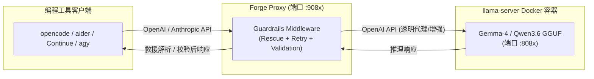

# Gemma-4 Local Servers on Jetson Orin

This repository contains Docker Compose configurations to deploy and run Gemma-4 models locally on an NVIDIA Jetson Orin AGX.

## 0. Prerequisites

- NVIDIA Jetson Orin AGX (configured with JetPack and NVIDIA Container Toolkit)
- Docker & Docker Compose
- SSD mounted at `/mnt/ssd/` with a `huggingface` directory for model caching

---

## 1. 什么是“量化感知训练”版本 (Quantization-Aware Training - QAT) ？

我们默认推荐并配置了 Gemma-4 31B 和 26B-A4B 的 **QAT (Quantization-Aware Training) 量化感知训练**版本（即文件名中的 `-qat`），其优势如下：

- **区别于传统量化 (PTQ)**：传统的 Post-Training Quantization (如常见的 `Q4_K_M`) 是直接对训练好的高精度权重进行截断压缩，这会导致模型（特别是数学、代码等强逻辑能力）出现明显的智力下降。
- **高精度、零损失**：QAT 是由 Google DeepMind 和 Unsloth 联合开发的技术。在模型微调/训练阶段就提前引入了量化误差的模拟，使模型在训练中自我适应 4-bit 环境。最终转换为 `UD-Q4_K_XL` 格式后，其**推理准确度几乎与原始未量化的 bfloat16 权重完全一致**。
- **显存极大节省**：31B QAT 版本在保持原版精度的前提下，显存开销仅需约 **18GB - 20GB**；26B-A4B 版本（MoE 混合专家架构，每次仅激活 4B 参数）更是只需要 **15GB - 18GB** 显存，是 Jetson Orin 等嵌入式边缘设备运行大模型的最优解。

---

## 2. 从零开始部署所需下载的资源 (Deploying From Scratch)

如果在一台干净的设备上从零开始部署，您需要准备和下载以下三个部分。针对国内网络环境，我们推荐使用**南京大学 (NJU) 镜像源**加速容器镜像拉取，以及**ModelScope**加速模型权重下载。

### 2.1. 推理引擎及容器镜像（使用南京大学镜像源加速）

由于国内直接访问 `ghcr.io` (GitHub Container Registry) 极慢或无法连接，推荐使用南京大学的 GHCR 镜像站拉取并使用“双标签”方式配置：

```bash
# A. 使用南大镜像源极速拉取 llama_cpp 镜像
docker pull ghcr.nju.edu.cn/nvidia-ai-iot/llama_cpp:latest-jetson-orin

# B. 为镜像打上官方标签（双标签指向同一 Image ID，不占用额外磁盘空间，确保 Compose 文件可无缝引用）
docker tag ghcr.nju.edu.cn/nvidia-ai-iot/llama_cpp:latest-jetson-orin ghcr.io/nvidia-ai-iot/llama_cpp:latest-jetson-orin
```

### 2.2. 大模型权重文件（使用 ModelScope 加速）

使用 ModelScope 魔搭社区的国内静态镜像带宽极速下载 `.gguf` 权重文件，详见下方的**模型下载指南**。

### 2.3. 系统依赖（宿主机一次性配置）

- 安装 Docker 和 Docker Compose。
- 安装 NVIDIA Container Toolkit 并配置 `/etc/docker/daemon.json`（已在您之前的系统文档中记录）。

---

## 3. 测试

在局域网内（另外一台电脑上），使用curl测试命令如下：

```bash
# linux or macOS terminal for Gemma 4 31B (端口 8080)
curl -sN http://192.168.137.251:8080/v1/chat/completions \
  -H 'Content-Type: application/json' \
  -d '{
    "model": "cyankiwi/gemma-4-31B-it-AWQ-4bit",
    "messages": [{"role": "user", "content": "你好"}],
    "chat_template_kwargs": {"enable_thinking": true},
    "stream": true
  }'

# windows PowerShell for Gemma 4 31B (端口 8080)
curl -sN http://192.168.137.251:8080/v1/chat/completions \
  -H 'Content-Type: application/json' \
  -d '{
    "model": "cyankiwi/gemma-4-31B-it-AWQ-4bit",
    "messages": [{"role": "user", "content": "你好"}],
    "chat_template_kwargs": {"enable_thinking": true},
    "stream": true
  }'
```

---

## 4. 极速模型下载指南 (Model Downloads via ModelScope)

在大陆网络环境下，直接从 Hugging Face 下载模型可能会非常缓慢或中断。**推荐使用阿里 ModelScope (魔搭社区) 下载**，它可以提供跑满带宽的极速下载体验，且无需配置代理。

### 4.1. 使用 uv 虚拟环境安装 ModelScope (推荐，保持系统干净)

如果宿主机上没有全局安装 `modelscope`，推荐使用现代 Python 包管理器 **`uv`** 创建虚拟环境并安装，避免污染系统的 Python 环境。在终端输入以下命令：

```bash
# 1. 在当前目录下创建虚拟环境 (.venv)
uv venv

# 2. 激活虚拟环境
source .venv/bin/activate

# 3. 使用 uv 安装 modelscope (速度极快)
uv pip install modelscope
```

> **极速免激活方案**：您也可以完全不激活虚拟环境，直接使用 `uv run` 临时带入运行，效果是一样的：
> `uv run --with modelscope modelscope download ...`

### 4.2. 从 ModelScope 下载 GGUF 权重到 SSD

激活虚拟环境后（或使用上面的 `uv run` 方案），利用 `modelscope` 命令行工具，只下载需要的单个 GGUF 文件并保存到缓存路径：

```bash
# Gemma-4 31B (Dense QAT GGUF)
modelscope download --model unsloth/gemma-4-31B-it-qat-GGUF gemma-4-31B-it-qat-UD-Q4_K_XL.gguf --local_dir /mnt/ssd/huggingface

#Gemma-4 26B-A4B (MoE QAT GGUF)
modelscope download --model unsloth/gemma-4-26B-A4B-it-qat-GGUF gemma-4-26B-A4B-it-qat-UD-Q4_K_XL.gguf --local_dir /mnt/ssd/huggingface

# Gemma-4 12B-Agentic (蒸馏精调编程版本 - yuxinlu1 - Q6_K无损量化)
modelscope download --model hf/yuxinlu1-gemma-4-12B-agentic-fable5-composer2.5-v2-3.5x-tau2-GGUF gemma4-v2-Q6_K.gguf --local_dir /mnt/ssd/huggingface

# Qwen3.6-35B-A3B (Qwen 官方原版 MoE 推理模型 - Unsloth UD-Q4_K_M 动态量化)
modelscope download --model unsloth/Qwen3.6-35B-A3B-GGUF Qwen3.6-35B-A3B-UD-Q4_K_M.gguf --local_dir /mnt/ssd/huggingface

# Qwen3.6-27B (Qwen 官方原版全参数 dense 推理模型 - Unsloth Q4_K_M 量化)
modelscope download --model unsloth/Qwen3.6-27B-GGUF Qwen3.6-27B-Q4_K_M.gguf --local_dir /mnt/ssd/huggingface
```

下载完成后，如果您不再需要该虚拟环境，可以直接输入 `deactivate` 退出虚拟环境，并删除生成的 `.venv` 文件夹（权重已安全地存在了 `/mnt/ssd/huggingface` 下）。

备份方案：如果通过 ModelScope 遇到问题，也可以使用 Hugging Face 的新命令行工具下载：

```bash
pip install -U huggingface_hub && export HF_ENDPOINT=https://hf-mirror.com && hf download unsloth/gemma-4-31B-it-qat-GGUF gemma-4-31B-it-qat-UD-Q4_K_XL.gguf --local-dir /mnt/ssd/huggingface
```

- [ModelScope -- Gemma4-12B v2 — 编程 + 智能体版](https://www.modelscope.cn/models/hf/yuxinlu1-gemma-4-12B-agentic-fable5-composer2.5-v2-3.5x-tau2-GGUF) **12B Agentic 版本**：这是由用户 `yuxinlu1` 基于 Gemma-4 12B 进行蒸馏精调的版本，专门针对 AI Agent 和代码分析场景进行了优化微调。虽然是 Q6_K 无损量化，但得益于蒸馏和针对性微调，在实际使用中表现出色，且推理速度更快，非常适合 Jetson Orin 等边缘设备部署。
  - [Yuxin Lu](https://huggingface.co/yuxinlu1)：Yuxin Lu 在 huggingface 上的主页

- [ModelScope -- Qwen3.6-35B-A3B-GGUF (Unsloth)](https://www.modelscope.cn/models/unsloth/Qwen3.6-35B-A3B-GGUF) **Qwen3.6 官方原版**：Qwen 官方 post-train 的 35B MoE 推理模型（总参 35B / 激活 3B），原生 262K 上下文，架构 `qwen3_5_moe`（Gated DeltaNet + Gated Attention 混合层 + 256 experts）。具备 agentic coding 与 thinking preservation 能力。此处使用 Unsloth 动态量化 `UD-Q4_K_M`（约 21GB），显存占用与本机其它大模型相当。相比社区蒸馏版（如 Qwopus3.6）更稳定可靠，是日常对话与编程的首选。

- [ModelScope -- Qwen3.6-27B-GGUF (Unsloth)](https://www.modelscope.cn/models/unsloth/Qwen3.6-27B-GGUF) **Qwen3.6 全参数 dense 版**：Qwen 官方 post-train 的 27B 全参数 dense 推理模型（**非 MoE，全部 27B 参数激活**），与 35B-A3B（MoE，仅激活 3B）形成互补。架构 `qwen3_5`（Gated DeltaNet + Gated Attention 混合层，64 层 dense），原生 262K 上下文，已被当前 llama.cpp（含 `LLM_ARCH_QWEN35`）支持。全参数激活使其对单点推理质量（尤其非 agentic 通用任务）更扎实稳定，代价是每 token 计算量大于 MoE 版。此处使用 Unsloth `Q4_K_M`（约 16GB），在 Jetson Orin AGX 64GB 统一内存下运行宽裕。

---

## 5. Configuration & Usage

The services run using the `nvidia` runtime and share the host network.

- **Gemma-4 31B**: Port `8080`
- **Gemma-4 26B-A4B**: Port `8081`
- **Gemma-4 12B-Agentic**: Port `8082` (针对 AI Agent、代码分析深度微调的 12B 无损量化版)
- **Qwen3.6 35B MoE**: Port `8084` (Qwen 官方原版 35B MoE 推理模型，总参 35B/激活 3B，原生 262K 上下文，稳定可靠，日常对话与编程首选)
- **Qwen3.6 27B**: Port `8085` (Qwen 官方原版 27B 全参数 dense 推理模型，全部 27B 参数激活，单点推理质量更扎实，与 MoE 版互补)

> **Qwen3.6 27B vs 35B-A3B 选型**（据[官方 README](https://github.com/QwenLM/Qwen3.6) 定位）：两者同为 Qwen3.6 系列、原生 262K 上下文、支持 thinking preservation，区别在架构与取舍。
> - **27B（dense，端口 8085）**：全部 27B 参数激活，官方定位 "Flagship-Level Coding"，单次推理质量更扎实、更稳定，适合日常对话与高质量单点任务。代价是每 token 计算量更大、速度相对慢。
> - **35B-A3B（MoE，端口 8084）**：总参 35B 但每 token 仅激活 3B，官方定位 "Agentic Coding Power"，速度快、长上下文吞吐高，适合智能体/多轮工具调用场景。
> - **建议**：日常对话与编程用 **27B**；智能体、长上下文、高并发场景用 **35B-A3B**。两者可按需起停，64GB 统一内存任一单独运行均宽裕。

### 5.1. Running the Services

```bash
# Start the Gemma-4 31B server
docker compose up -d gemma4-31b

# Start the Gemma-4 26B-A4B server
docker compose up -d gemma4-26b-a4b

# Start the Gemma-4 12B-Agentic server
docker compose up -d gemma4-12b-agentic

# Start the Qwen3.6 35B MoE server
docker compose up -d qwen36-35b-moe

# Start the Qwen3.6 27B server
docker compose up -d qwen36-27b

# Stop the services
docker compose down
```

### 5.2. Viewing Real-time Logs

To monitor model loading progress and API requests, view logs in real-time:

```bash
# View all logs
docker compose logs -f

# View logs for a specific model service
docker compose logs -f gemma4-31b
docker compose logs -f gemma4-26b-a4b
docker compose logs -f gemma4-12b-agentic
docker compose logs -f qwen36-35b-moe
```

### 5.3. 更新推理引擎 `llama.cpp`

本项目采用**宿主机编译 + Docker volume 挂载**方案（详见 [Dockerfile](file:///home/hxf0223/tmp/gemma-server/Dockerfile)）：
llama.cpp 在宿主机上编译并安装到 `/usr/local`，通过 volume 挂载注入容器，**无需在 Docker 内编译**。

更新 llama.cpp 到最新版（需要代理/网络）：

```bash
# 确认 /usr/local/lib 添加到 ldconfig 搜索路径，如果没有添加，则执行如下添加操作
echo "/usr/local/lib" | sudo tee /etc/ld.so.conf.d/usr_local_lib.conf
sudo ldconfig

# 首次需要安装编译依赖 Ninja
sudo apt install ninja-build

# 1. 更新 llama.cpp submodule 源码
cd llama.cpp && git pull && cd ..

# 2. 在宿主机重新编译（使用与现有安装相同的优化参数）
cmake -B build -G Ninja \
    -DGGML_CUDA=ON \
    -DCMAKE_CUDA_ARCHITECTURES=87 \
    -DCMAKE_BUILD_TYPE=Release \
    -DGGML_CUDA_F16=ON \
    -DGGML_CUDA_FA_ALL_QUANTS=ON \
    -DGGML_CUDA_DMMV_X=64 \
    -DGGML_CUDA_MMV_Y=2 \
    -DGGML_CUDA_NO_VMM=ON \
    -DLLAMA_CURL=ON

cmake --build build --config Release --parallel

# 3. 安装到宿主机 /usr/local（需要 sudo）
sudo cmake --install build --prefix /usr/local
sudo ldconfig

# 4. 重启容器即可生效（无需 docker compose build！）
docker compose restart
```

### 5.4. 架构说明 (Dockerfile 设计)

> **⚠️ JetPack 7.2 / CUDA 13.2 兼容性与 NVIDIA Container Toolkit 报错修复说明**
>
> 1. **旧镜像不可用**：旧的 `ghcr.io/nvidia-ai-iot/llama_cpp` 镜像由于基于 JetPack 6 (CUDA 12.x) 构建，在 JetPack 7.2 上会有 CUDA ABI 不兼容报错，因此必须采用本地编译 + Docker 运行的模式。
>
> 2. **CDI Hook Panic 修复**：在 JetPack 7.2 (CUDA 13.2.1 / nvidia-container-toolkit 1.19.1) 上，如果使用默认的 `mode = "auto"` 运行 NVIDIA 容器，在容器启动时会触发 `nvidia-cdi-hook` 的 Bug：
>    `panic: runtime error: slice bounds out of range [:73] with capacity 71`。
>    **修复方法**：
>    - 编辑宿主机的 `/etc/nvidia-container-runtime/config.toml`，将 `mode` 设为 `cdi`：
>
>      ```toml
>      [nvidia-container-runtime]
>      mode = "cdi"
>      ```
>
>    - 创建或修改 `/etc/nvidia-container-toolkit/nvidia-cdi-refresh.env`，加入禁用出错 hook 的环境变量：
>
>      ```bash
>      NVIDIA_CTK_CDI_GENERATE_DISABLED_HOOKS=enable-cuda-compat,update-ldcache
>      ```
>
>    - 重新生成 CDI 配置并重启容器服务：
>
>      ```bash
>      sudo systemctl restart nvidia-cdi-refresh.service
>      sudo systemctl restart containerd
>      sudo systemctl restart docker
>      ```
>
> 3. **挂载与环境变量调整**：
>    - [Dockerfile](file:///home/hxf0223/tmp/gemma-server/Dockerfile) 使用了 `cuda:13.2.1-runtime-ubuntu24.04` 轻量运行镜像，不含编译步骤。
>    - llama-server 的二进制和库挂载至容器的 `/opt/llama/bin` 和 `/opt/llama/lib`，避开标准库路径。
>    - 由于禁用了 `update-ldcache` 钩子，必须在 [docker-compose.yml](file:///home/hxf0223/tmp/gemma-server/docker-compose.yml) 的 `LD_LIBRARY_PATH` 环境变量中手动指定包含 `nvgpu` 用户态驱动路径（如 `/opt/nvidia/l4t-gpu-libs/nvgpu`），**注意不要加入 `openrm` 路径**，否则会导致 CUDA 设备无法识别。

**编译参数**（在宿主机执行 cmake 时使用）：

| 参数                          | 作用                                                    |
| ----------------------------- | ------------------------------------------------------- |
| `GGML_CUDA=ON`                | 启用 CUDA 后端                                          |
| `CMAKE_CUDA_ARCHITECTURES=87` | 仅编译 sm_87 (Orin AGX)，缩短编译时间并减小体积         |
| `GGML_CUDA_F16=ON`            | Flash Attention 使用 FP16 Tensor Core，长上下文推理加速 |
| `GGML_CUDA_FA_ALL_QUANTS=ON`  | 对所有量化格式均启用 Flash Attention，防止回退到慢路径  |
| `GGML_CUDA_DMMV_X=64`         | 矩阵-向量乘法 X 维并行度，匹配 Orin 2048 CUDA Cores     |
| `GGML_CUDA_MMV_Y=2`           | 矩阵-向量乘法 Y 维并行度，社区实测可获得 10~20% 加速    |
| `GGML_CUDA_NO_VMM=ON`         | 禁用 VMM 大块预分配，专为 Jetson UMA 共享内存架构设计   |
| `LLAMA_CURL=ON`               | llama-server 支持从 URL 加载模型                        |

运行时通过 `GGML_CUDA_ENABLE_UNIFIED_MEMORY=1` 环境变量启用统一内存调度，
社区实测可提升推理性能约 **10~15%**。

### 5.5. ~~直接在本地运行 Qwopus3.6-35B-A3B（不使用 Docker）~~ [已废弃]

> **此方案已被 [Dockerfile](file:///home/hxf0223/tmp/gemma-server/Dockerfile) 取代，无需再手动编译安装。**
>
> 之前需要手动编译是因为 `ghcr.io/nvidia-ai-iot/llama_cpp` 预编译镜像版本过旧，
> 不支持 Qwopus3.6-35B-A3B 等新模型的结构。现在 [Dockerfile](file:///home/hxf0223/tmp/gemma-server/Dockerfile)
> 已改为在构建时自动编译最新版 llama.cpp，所有模型统一通过 Docker Compose 启动：
>
> ```bash
> docker compose up -d qwen36-35b-moe
> ```
>
> 宿主机 `~/.local` 下手动安装的 llama.cpp 已同步清除，不再需要维护。

---

## 6. 接入 Pi Agent 配置 (Connecting to Pi Agent)

如果需要将本地部署的 Gemma-4 接入开源终端编程助手 **Pi Agent (`pi-coding-agent`)**，请按照以下步骤进行配置：

### 6.1. 配置自定义模型接口 (`~/.pi/agent/models.json`)

创建或修改 `~/.pi/agent/models.json` 文件，将本地的 31B（端口 8080）和 26B-A4B（端口 8081）分别注册为自定义 Provider：

```json
{
  "providers": {
    "local-gemma-31b": {
      "baseUrl": "http://localhost:8080/v1",
      "api": "openai-completions",
      "apiKey": "not-needed",
      "models": [
        {
          "name": "Local Gemma-4 31B",
          "id": "gemma-4-31B",
          "contextWindow": 65536,
          "maxOutputTokens": 16384,
          "input": ["text"]
        }
      ]
    },
    "local-gemma-26b": {
      "baseUrl": "http://localhost:8081/v1",
      "api": "openai-completions",
      "apiKey": "not-needed",
      "models": [
        {
          "id": "gemma-4-26B",
          "name": "Local Gemma-4 26B",
          "contextWindow": 8192,
          "maxOutputTokens": 2048,
          "input": ["text"]
        }
      ]
    },
    "local-gemma-12b-agentic": {
      "baseUrl": "http://localhost:8082/v1",
      "api": "openai-completions",
      "apiKey": "not-needed",
      "models": [
        {
          "id": "gemma-4-12b-agentic",
          "name": "Local Gemma-4 12B Agentic",
          "contextWindow": 65536,
          "maxOutputTokens": 16384,
          "input": ["text"]
        }
      ]
    },
    "local-qwen36-35b-moe": {
      "baseUrl": "http://localhost:8084/v1",
      "api": "openai-completions",
      "apiKey": "not-needed",
      "models": [
        {
          "id": "qwen3.6-35b-moe",
          "name": "Local Qwen3.6 35B MoE",
          "contextWindow": 131072,
          "maxOutputTokens": 16384,
          "input": ["text"]
        }
      ]
    },
    "local-qwen36-27b": {
      "baseUrl": "http://localhost:8085/v1",
      "api": "openai-completions",
      "apiKey": "not-needed",
      "models": [
        {
          "id": "qwen3.6-27b",
          "name": "Local Qwen3.6 27B",
          "contextWindow": 131072,
          "maxOutputTokens": 16384,
          "input": ["text"]
        }
      ]
    }
  }
}
```

### 6.2. 配置默认模型 (`~/.pi/agent/settings.json`)

若希望默认调用本地 12B-Agentic 模型，请在 `~/.pi/agent/settings.json` 中配置：

```json
{
  "defaultProvider": "local-gemma-12b-agentic",
  "defaultModel": "gemma4-v2-Q6_K",
  "defaultThinkingLevel": "off"
}
```

_注：建议将 `defaultThinkingLevel` 设为 `"off"` 以确保本地运行流畅。_

### 6.3. 会话中动态切换模型

在 `Pi Agent` 的交互命令行中，可直接输入 `/model` 指令进行切换：

```bash
# 切换到 12B Agentic 模型（推荐，速度最快、专门面向多轮分析微调）
/model local-gemma-12b-agentic/gemma4-v2-Q6_K

#切换到 31B 模型
/model local-gemma-31b/unsloth/gemma-4-31B-it-qat-GGUF:UD-Q4_K_XL

#切换到 26B A4B 模型
/model local-gemma-26b/unsloth/gemma-4-26B-A4B-it-qat-GGUF:UD-Q4_K_XL

#切换到 Qwen3.6 35B MoE 模型 (推荐，官方原版，稳定可靠，智能体推荐)
/model local-qwen36-35b-moe/qwen3.6-35b-moe

#切换到 Qwen3.6 27B 模型 (全参数 dense，单点推理质量更扎实)
/model local-qwen36-27b/qwen3.6-27b
```

---

## 7. 接入 Forge Proxy — Tool-Calling Guardrails 代理 (Forge Proxy Integration)

[Forge](https://github.com/antoinezambelli/forge) 是一个专为**自托管 LLM tool-calling 可靠性**设计的 Python 框架（代码仓库：[antoinezambelli/forge](https://github.com/antoinezambelli/forge)，搜索/PyPI 关键字：`"forge guardrails"` 或 `forge-guardrails`）。它的核心功能是作为**透明代理 (Drop-in Proxy)** 坐在编程工具客户端（opencode、aider、Continue、Cline、Claude Code 等）和本地 llama-server 之间，自动应用 guardrails（救援解析、重试提示、响应校验），让客户端以为自己在对话一个更聪明的模型。

> **Forge 能带来什么？** 在 Forge 的 26 场景评估套件上，一个 8B 本地模型的 tool-calling 成功率可以从个位数飙升到 **84%**；即便是 Sonnet 4.6 也能从 85% 提升到 **98%**。对于本机部署的大模型来说，这意味着编程助手的工具调用可靠性获得质的飞跃。

### 7.1. 架构示意



客户端只需将 `base_url` 指向 Forge Proxy（如 `http://localhost:9084/v1`），Forge 在中间透明地做 tool-calling 增强，客户端和后端均无需任何修改。

### 7.2. 安装 Forge

推荐使用 `uv tool install` 安装（PyPI/搜索关键字：`forge-guardrails`），这样 `forge-proxy` 会作为全局可用的命令行工具，与系统 Python 环境完全隔离：

```bash
# 一行安装（已完成）
uv tool install --python 3.12 forge-guardrails

# 验证安装
forge-proxy --help
```

> 也可以使用 `pip install forge-guardrails` 或 `uv pip install forge-guardrails` 安装到虚拟环境。

### 7.3. 启动 Forge Proxy (External Mode)

Forge Proxy 运行在 **External Mode**：你自己管理后端（Docker 容器中的 llama-server），Forge 仅做代理转发 + guardrails 增强。

#### 基本命令格式

```bash
forge-proxy --backend-url http://localhost:<后端端口> --host 0.0.0.0 --port <Forge代理端口> --serialize -v
```

#### 各模型的启动示例

```bash
# 代理 Gemma-4 31B (后端 :8080 → Forge :9080)
forge-proxy --backend-url http://localhost:8080 --host 0.0.0.0 --port 9080 --serialize -v

# 代理 Gemma-4 26B-A4B (后端 :8081 → Forge :9081)
forge-proxy --backend-url http://localhost:8081 --host 0.0.0.0 --port 9081 --serialize -v

# 代理 Gemma-4 12B-Agentic (后端 :8082 → Forge :9082)
forge-proxy --backend-url http://localhost:8082 --host 0.0.0.0 --port 9082 --serialize -v

# 代理 Qwen3.6 35B MoE (后端 :8084 → Forge :9084)
forge-proxy --backend-url http://localhost:8084 --host 0.0.0.0 --port 9084 --serialize -v

# 代理 Qwen3.6 27B (后端 :8085 → Forge :9085)
forge-proxy --backend-url http://localhost:8085 --host 0.0.0.0 --port 9085 --serialize -v
```

> **`--serialize`**：强制请求串行化，防止单 GPU 后端并发导致 OOM 或推理错误，适用于 Jetson Orin 单卡环境。
>
> **端口规划**：建议 Forge 代理端口 = 后端端口 + 1000（如 8080 → 9080），方便记忆和区分。

#### 后台运行 (使用 systemd 或 tmux)

生产环境下，可使用 `tmux` 或 `systemd` 将 forge-proxy 运行在后台。以 `tmux` 为例：

```bash
# 创建一个名为 forge 的 tmux 会话
tmux new-session -d -s forge 'forge-proxy --backend-url http://localhost:8084 --host 0.0.0.0 --port 9084 --serialize -v'

# 查看 forge 会话日志
tmux attach -t forge

# 从 tmux 会话分离（保持后台运行）：按 Ctrl+B 然后按 D
```

### 7.4. 常用高级参数

| 参数                        | 默认值      | 说明                                                                                     |
| --------------------------- | ----------- | ---------------------------------------------------------------------------------------- |
| `--backend-url`             | —           | 后端 llama-server 的 URL（External Mode 必选）                                           |
| `--host`                    | `127.0.0.1` | Forge 监听地址。设为 `0.0.0.0` 以允许局域网访问                                          |
| `--port`                    | `8081`      | Forge 监听端口                                                                           |
| `--serialize`               | 关          | 串行化请求，单 GPU 必开                                                                  |
| `--max-retries`             | `3`         | 每个请求的最大重试次数                                                                   |
| `--max-tool-errors`         | `2`         | 每个请求中允许的最大连续工具调用错误数                                                   |
| `--backend-timeout`         | `300`       | 后端响应超时（秒），大模型推理慢时可适当增大                                             |
| `--no-rescue`               | 关          | 禁用救援解析（不推荐）                                                                   |
| `--inject-respond-tool`     | 关          | 注入合成的 respond() 工具，让小模型保持 tool-calling 模式                                |
| `--reasoning-replay`        | `none`      | 推理链回放策略：`none`（最省 token）/ `keep-last` / `full`                               |
| `--budget-mode`             | `backend`   | 上下文预算模式：`backend`（自动从后端获取）/ `manual`（手动指定）                        |
| `--budget-tokens`           | —           | 手动指定 token 预算（需配合 `--budget-mode manual`）                                     |
| `-v` / `--verbose`          | 关          | 详细日志输出，调试时必开                                                                 |

### 7.5. 客户端配置 — 将编程工具指向 Forge Proxy

Forge 对客户端完全透明，只需将客户端的 API 地址改为 Forge Proxy 即可。

#### opencode

在 `opencode.json` 或环境变量中配置：

```json
{
  "provider": {
    "id": "openai",
    "api_key": "not-needed",
    "models": {
      "forge-qwen36-35b": {
        "id": "forge-qwen36-35b",
        "api_url": "http://<JETSON_IP>:9084/v1"
      }
    }
  }
}
```

或使用环境变量：

```bash
export OPENAI_API_KEY="not-needed"
export OPENAI_BASE_URL="http://<JETSON_IP>:9084/v1"
```

#### aider

```bash
aider --openai-api-base http://<JETSON_IP>:9084/v1 --openai-api-key not-needed
```

#### Continue (VS Code 插件)

在 `~/.continue/config.json` 中添加模型配置：

```json
{
  "models": [
    {
      "title": "Forge Qwen3.6 35B",
      "provider": "openai",
      "model": "qwen3.6-35b-moe",
      "apiBase": "http://<JETSON_IP>:9084/v1",
      "apiKey": "not-needed"
    }
  ]
}
```

#### curl 测试

```bash
# 通过 Forge Proxy 发送请求（注意端口是 Forge 的 9084 而不是直连后端的 8084）
curl -sN http://<JETSON_IP>:9084/v1/chat/completions \
  -H 'Content-Type: application/json' \
  -d '{
    "model": "qwen3.6-35b-moe",
    "messages": [{"role": "user", "content": "你好"}],
    "stream": true
  }'
```

### 7.6. Forge Proxy 端口速查表

| 模型                  | 后端端口 (llama-server) | Forge 代理端口 | 直连 URL                         | Forge URL                        |
| --------------------- | ----------------------- | -------------- | -------------------------------- | -------------------------------- |
| Gemma-4 31B           | 8080                    | 9080           | `http://<IP>:8080/v1`            | `http://<IP>:9080/v1`            |
| Gemma-4 26B-A4B       | 8081                    | 9081           | `http://<IP>:8081/v1`            | `http://<IP>:9081/v1`            |
| Gemma-4 12B-Agentic   | 8082                    | 9082           | `http://<IP>:8082/v1`            | `http://<IP>:9082/v1`            |
| Qwen3.6 35B MoE       | 8084                    | 9084           | `http://<IP>:8084/v1`            | `http://<IP>:9084/v1`            |
| Qwen3.6 27B           | 8085                    | 9085           | `http://<IP>:8085/v1`            | `http://<IP>:9085/v1`            |

> **选择建议**：日常编程和 tool-calling 场景推荐走 Forge 代理端口；简单对话或不涉及工具调用的场景可直连后端端口。

---

## 8. Jetson 性能优化与故障排查 (Jetson Performance & Troubleshooting)

### 8.1. 扩大 Swap 交换空间 (防止长上下文 OOM 闪退)

在运行长上下文或多个大模型容器时，若超出 64GB 物理内存可能导致容器因 OOM（Out of Memory）被系统直接强制终止。建议在 SSD 上扩充 **16GB** 的 Swap 空间：

```bash
# 清除所有缓存
echo 3 | sudo tee /proc/sys/vm/drop_caches

# A. 关闭当前系统 swap
sudo swapoff -a

# B. 在 SSD 挂载路径下创建 16GB 大小的交换文件 (以 /mnt/ssd/ 目录为例)
sudo dd if=/dev/zero of=/mnt/ssd/swapfile bs=1G count=16

# C. 设置安全权限并初始化 swap 分区
sudo chmod 600 /mnt/ssd/swapfile
sudo mkswap /mnt/ssd/swapfile

# D. 启动新 swap
sudo swapon /mnt/ssd/swapfile
```

若需每次开机自动加载，请在宿主机编辑 `/etc/fstab` 文件并在末尾追加一行：

```text
/mnt/ssd/swapfile swap swap defaults 0 0
```

### 8.2. 内存锁定失败警告 (failed to mlock ... Cannot allocate memory)

- **警告原因**：当运行带 `--mlock` 参数的容器服务时，Docker 默认限制了容器能锁定的最大物理内存，从而导致 `failed to mlock`。
- **解决方案**：已在 [docker-compose.yml](file:///home/hxf0223/tmp/gemma-server/docker-compose.yml) 基础模板 `ulimits.memlock` 中将限制设为 `-1`（不限额）。请重新拉起服务使配置生效（警告信息会在重新启动后消失）。

---

## 9. Docker & 本地 LLM 常用运维命令速查 (Docker & Local LLM Cheat Sheet)

在本地测试与部署大模型时，您在宿主机终端可能会高频使用以下命令：

### 9.1. 启动和停止服务

```bash
#后台启动所有模型服务（首次运行时会下载镜像）
docker compose up -d

#启动特定的模型服务（例如仅运行 Qwen3.6 MoE）
docker compose up -d qwen36-35b-moe

# 重启某个已运行的模型（修改配置文件或遇到异常时常用）
docker compose restart qwen36-35b-moe

#停止并完全销毁所有容器（不会删除已下载的模型权重）
docker compose down

# 仅停止（暂停）容器而不删除它
docker compose stop
```

### 9.2. 查看状态与运行日志

```bash
# 查看当前正在运行的容器状态
docker compose ps

# 实时查看所有服务日志
docker compose logs -f

# 查看单个服务日志
docker compose logs -f qwen36-35b-moe

# 查看最近 100 行日志，并附带时间戳
docker compose logs --tail=100 -f -t qwen36-35b-moe
```

### 9.3. 硬件与资源监控

```bash
# 监控 Jetson 整机状态
jtop

# 查看 Docker 容器的 CPU / 内存占用
docker stats
```

### 9.4. 引擎升级与高级调试

```bash
# 升级 llama.cpp 推理引擎
docker compose pull && docker compose up -d

# 进入正在运行的容器 shell
docker exec -it qwen36-35b-moe bash
```

---

## 10. Multiline Input in Client Terminal (agy / MobaXterm)

If you are accessing this server via SSH client (like MobaXterm on Windows) and using `agy` or another terminal-based client, the standard `Enter` key will send your message immediately.

To insert a newline (multiline text) in the terminal:

1. **Shortcut Combinations**: Try `Shift + Enter` or `Alt + Enter`.
2. **Raw Carriage Return (Universal)**: Press `Ctrl + V` followed by `Enter` to input a literal newline character (`\n`) into the prompt.
3. **Copy-Paste Method**: Draft your multiline text in a local text editor (like Notepad/VS Code), copy it, and paste it into MobaXterm using the right-click menu.

---

## 11. 资源

- [Forge 官方仓库](https://github.com/antoinezambelli/forge)：自托管 LLM tool-calling 可靠性框架（PyPI/检索关键字：`"forge guardrails"` / `forge-guardrails`）
- [Forge 讨论帖子](https://news.ycombinator.com/item?id=48192383)：Forge来自 TI 的一个 AI 部门总监
- [reddit](https://www.reddit.com/)：代替 stackoverflow 社区
- [NVIDIA AI IOT](https://github.com/NVIDIA-AI-IOT)：NVIDIA 官方 AI IOT 仓库集合
- [Jetson Containers Quickstart on NVIDIA Jetson AGX Orin 64GB](https://forums.developer.nvidia.com/t/jetson-containers-quickstart-on-nvidia-jetson-agx-orin-64gb/365700)：值得学习一遍
- [nocodo](https://github.com/brainless/nocodo)：一个 Coding agent
